<p align="center">
  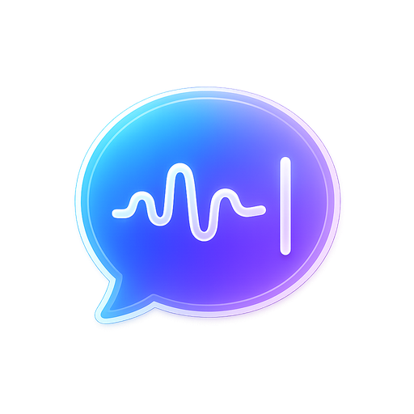
</p>

<h1 align="center">HoldType</h1>

<p align="center">
  <strong>Native macOS voice input for AI work and everyday writing.</strong>
</p>

HoldType is a small menu bar app for people who would rather speak than type.
Hold <kbd>Right Command</kbd>, talk naturally, release, and HoldType transcribes
through your own OpenAI API key before inserting the finished text into the app
you were already using.

No HoldType account. No HoldType subscription. No Electron shell. No telemetry.

The source code is available for transparency, so you can inspect how HoldType
records audio, sends OpenAI requests, and handles local data. You can also
build HoldType yourself if you prefer running your own build.

<p align="center">
  <a href="https://github.com/holdtype/holdtype-swift/releases/latest"><strong>Download latest release</strong></a>
  |
  <a href="#how-it-works">How it works</a>
  |
  <a href="#privacy">Privacy</a>
  |
  <a href="#development">Development</a>
</p>

<p align="center">
  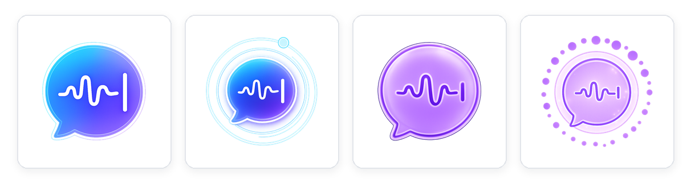
</p>

<p align="center">
  <strong>Built from a developer's daily dictation workflow.</strong><br>
  I tried Wispr Flow, OpenWhispr, Codex voice input, and a long list of smaller
  tools. Voice worked for long prompts, reviews, mail, and notes. The missing
  part was a global Mac app with a native Swift recording path, not another web
  product.
</p>

<p align="center">
  HoldType keeps that path short: hold a key in any app, speak, release. OpenAI
  handles transcription through my own key; HoldType adds the workflow pieces I
  kept wanting, including translation and spoken emoji commands.
</p>

<p align="center">
  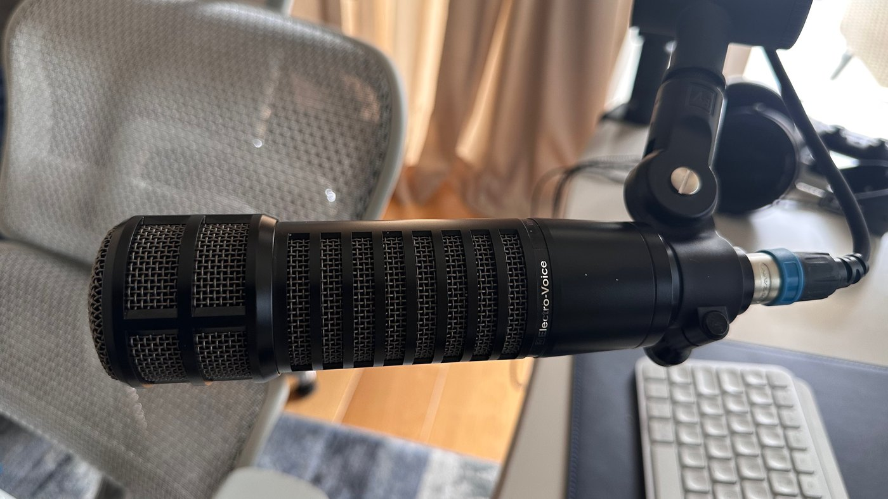
  <br>
  <sub>My actual microphone setup. HoldType is built around voice as a primary input device, not an occasional dictation feature.</sub>
</p>

<p align="center">
  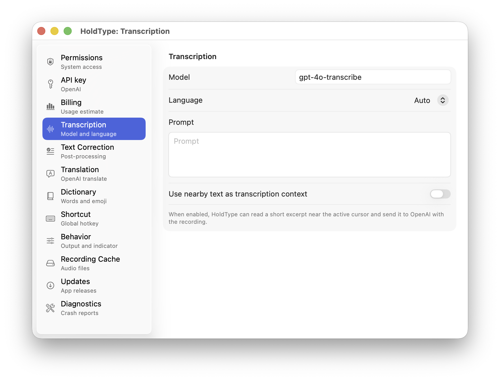
</p>

## Why HoldType Exists

Those constraints shaped the product. I wanted a dictation tool that stayed out
of the way and matched how I work across code, AI chats, mail, docs, and notes:

- OpenAI transcription quality by default, starting with `gpt-4o-transcribe`
- direct OpenAI API billing through my own key, not another app subscription
- native Swift instead of a TypeScript web shell
- fast hold-to-record input for Codex, Claude, ChatGPT, mail, docs, and chats
- translation when you want to speak in your native language and get text in
  another language, such as English
- spoken emoji commands for common symbols without another API request
- minimal correction without turning dictation into a rewriting product

The name comes from the interaction itself: hold a key, speak, release, and get
typed text in the app you were already using. HoldType is still built for coding
with AI, but it is broader than code. I still type fast, but a microphone has
become my primary input device because it lets me say the full thought I would
otherwise shorten or skip. That matters for AI prompts, but it also matters for
mail, documentation, notes, and everyday text.

The codebase is part of that experiment too. HoldType has been built through
Codex, directed and tested through the same voice-first workflow it is meant to
support.

## How It Works

1. Add your OpenAI API key. HoldType stores it locally in macOS Keychain.
2. Hold <kbd>Right Command</kbd> to record from any app.
3. Release the key. HoldType transcribes the audio through OpenAI.
4. The accepted text is inserted at the cursor in the active app.

When the floating indicator is enabled, a compact activity indicator appears
near the lower-right corner of the active display during recording and
transcription without stealing focus from the app you are using.

For translation, choose a target language in Settings and hold
<kbd>Right Command</kbd> + <kbd>Right Option / Alt</kbd>. That records the same
way, then translates the accepted transcript before inserting it.

<p align="center">
  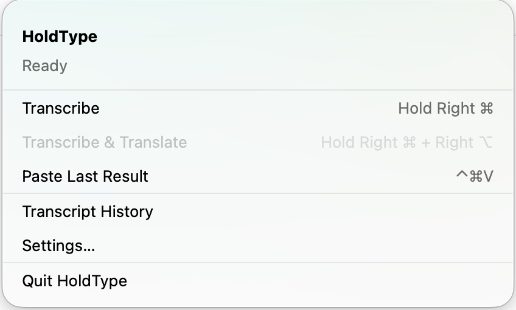
</p>

## What Makes It Different

### Bring Your Own OpenAI Key

HoldType does not meter you through a HoldType account. It sends requests
through your OpenAI Platform account, so you pay OpenAI directly for the API
usage you choose to make.

<p align="center">
  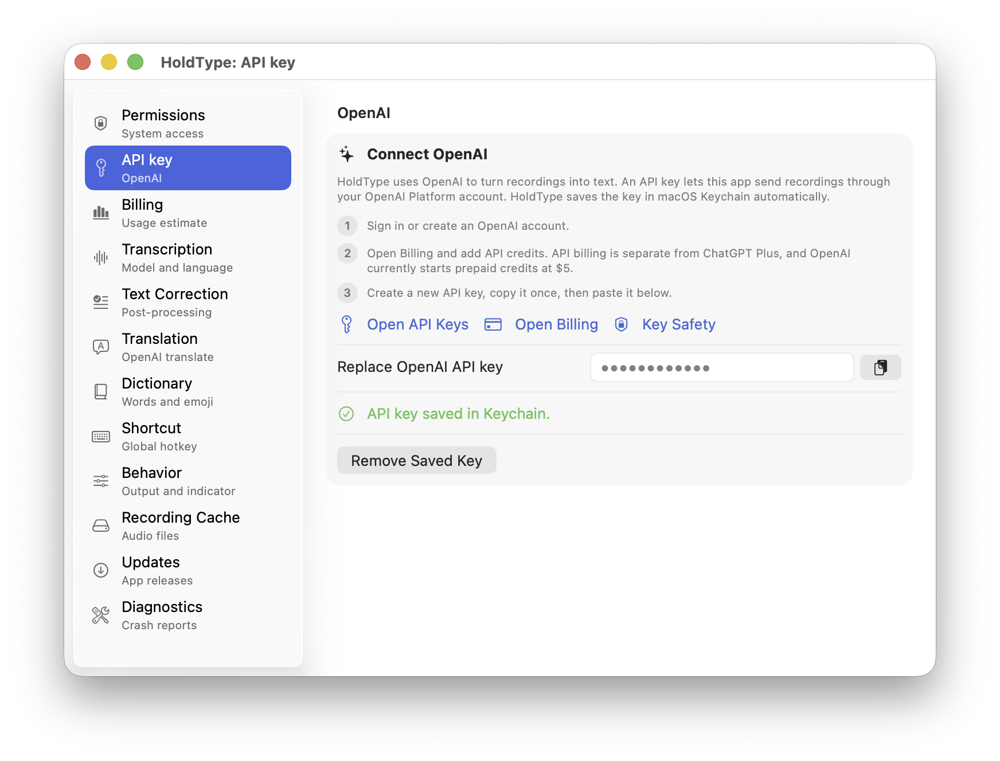
</p>

### Built Around OpenAI Transcription

The default transcription model is `gpt-4o-transcribe`. You can keep language
on Auto, choose a fixed language, add prompt guidance, and optionally include a
short nearby text excerpt so continued dictation matches the current context.

### Teach It Your Project Vocabulary

The Dictionary keeps local words and phrases that should be spelled exactly
when they appear in dictation. I use it for project names, file names, product
terms, and personal names that general transcription tools often get wrong.

<p align="center">
  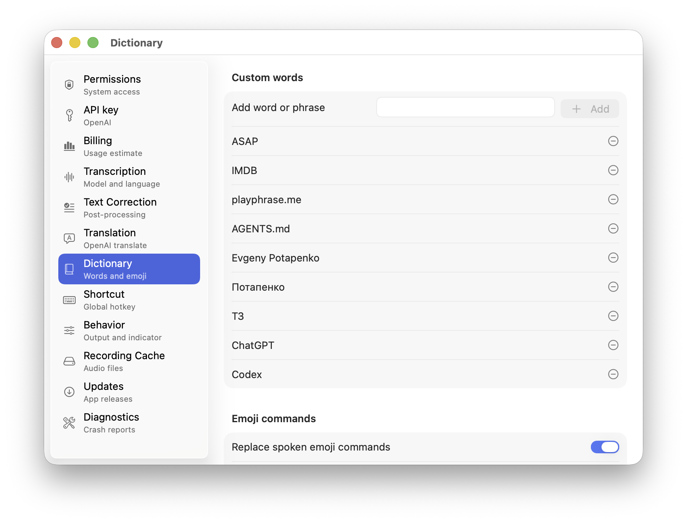
</p>

### Speak In Your Native Language, Send English

Hold <kbd>Right Command</kbd> + <kbd>Right Option / Alt</kbd> for a translation
session. HoldType records the same way, then translates the accepted transcript
into the configured target language before inserting it. I use this when the
thought is clearer in Russian but the reply, prompt, or comment needs to land in
English.

<p align="center">
  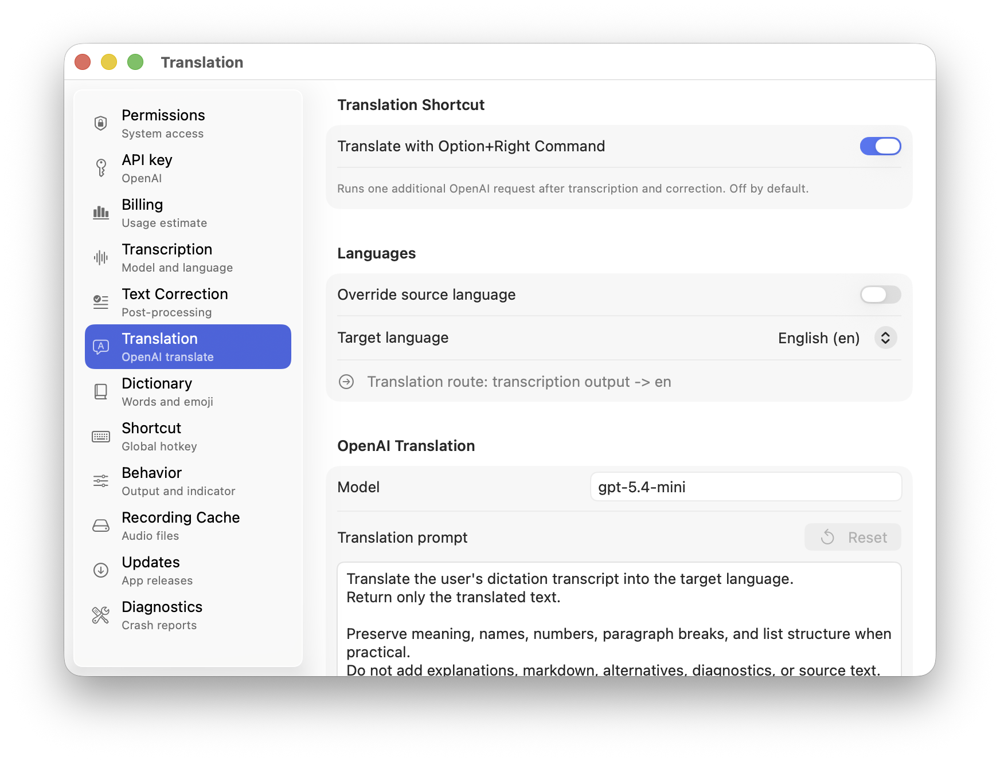
</p>

### Say Emoji Commands Out Loud

For chats, social posts, and comments, HoldType can replace explicit spoken
commands such as `emoji heart`, `emoji laugh`, or `emoji thumbs up` with the
matching emoji after transcription. The replacement is local, so it does not
make another OpenAI request or require an emoji picker.

<p align="center">
  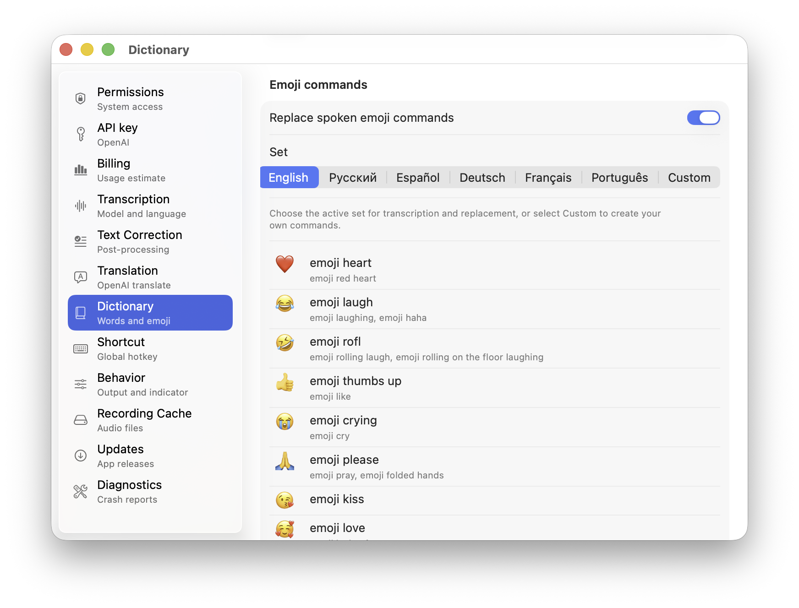
</p>

### Correction Without Rewriting You

Correction has two separate layers. OpenAI correction is optional, off by
default, and sends the transcript through a second model request. I usually
leave it off because it slows down the path from speaking to inserted text. It
is there for users who want one more minimal cleanup pass for obvious
transcription errors, spacing, capitalization, and punctuation.

The local cleanup layer is different. It runs without another API call and can
normalize quotes, long dashes, ellipses, spacing, and literal replacement rules.
That is the part I keep on: it removes small typographic tells that make
dictated text look more AI-generated than it needs to.

<p align="center">
  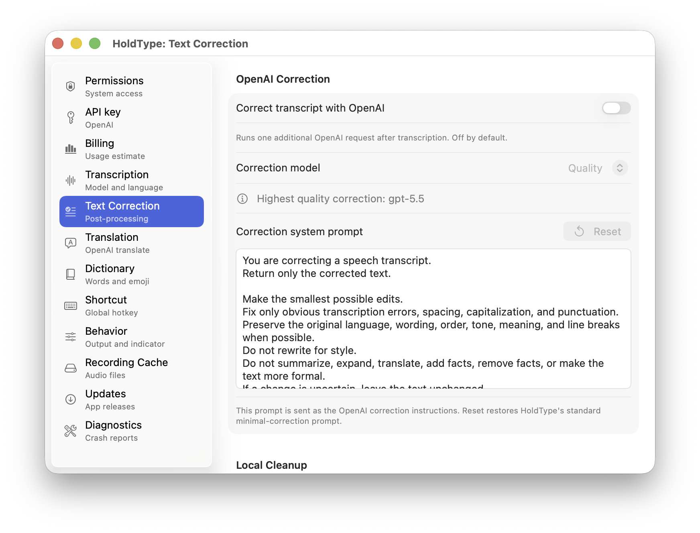
</p>

### Recovery When Insertion Fails

Automatic insertion targets the active Mac app at the cursor. HoldType can also
keep the last accepted transcript as Last Result, available through
<kbd>Control</kbd> + <kbd>Command</kbd> + <kbd>V</kbd>, without overwriting the
macOS system clipboard.

<p align="center">
  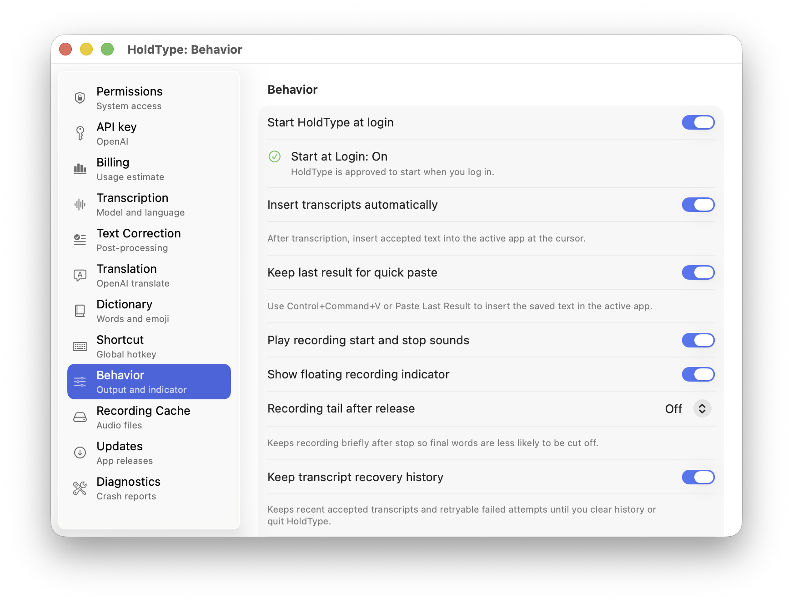
</p>

## Cost Model

HoldType itself is free to use. OpenAI API usage is billed by OpenAI, through
your own OpenAI Platform account. In my own heavy voice-input workflow, the
local HoldType estimate is usually in single-digit dollars per month rather
than a fixed app subscription.

The Billing screen is intentionally an estimate from this Mac's successful
transcriptions. It is not your OpenAI invoice, balance, or account dashboard.
Always use [OpenAI pricing](https://developers.openai.com/api/docs/pricing) as
the source of truth for current model prices.

<p align="center">
  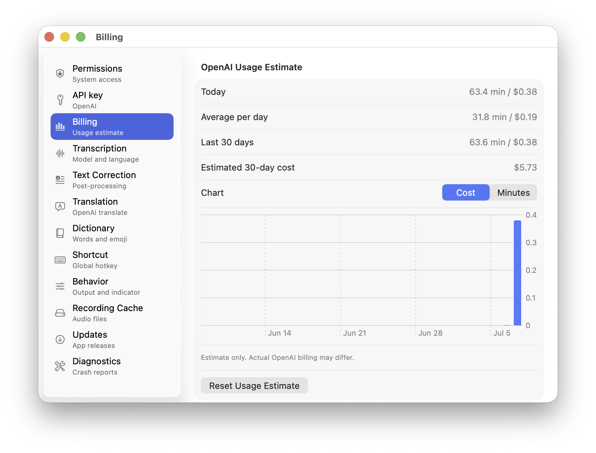
</p>

## Privacy

HoldType is designed to keep the product boundary simple:

- Your OpenAI API key is stored in macOS Keychain.
- Audio is sent to OpenAI when a recording is transcribed.
- If OpenAI correction is enabled, transcript text is sent in a second OpenAI
  request.
- If translation mode is enabled, transcript text is sent in a translation
  request before output delivery.
- Nearby text context is optional and bounded to a short excerpt near the
  active cursor.
- HoldType has no account system, server-side app state, analytics, telemetry,
  or cloud sync.
- Transcript recovery is local. The app clipboard is not the macOS system
  clipboard.

## Install

### GitHub Release

1. Download `HoldType-<version>.dmg` from the
   [latest GitHub Release](https://github.com/holdtype/holdtype-swift/releases/latest).
2. Open the disk image.
3. Drag `HoldType.app` into Applications.
4. Launch HoldType.
5. Grant the macOS permissions needed for microphone recording, global
   shortcuts, and active-app insertion.
6. Paste an OpenAI API key in Settings.

### Homebrew

The first Homebrew channel is a project-owned tap. A branded tap such as
`holdtype/homebrew-tap` gives users a non-personal fallback channel while the
official Homebrew Cask submission is pending. Once that tap is published for a
release, the cask path is:

```sh
brew tap holdtype/tap && brew install --cask holdtype && open -a HoldType
```

After HoldType is accepted into the official Homebrew Cask repository, fresh
Homebrew installs can use the short command:

```sh
brew install --cask holdtype && open -a HoldType
```

## Platforms

This repository is the macOS version of HoldType. It currently supports macOS
only.

Windows and Linux are planned as separate repositories later, built with the
same voice-first approach and OpenAI-key workflow, but implemented natively for
those platforms instead of being shipped from this Swift codebase.

## License

HoldType is source-available under the Functional Source License 1.1 with an
MIT future license.

You may read, learn from, modify, build, and run HoldType from source for
personal or internal use, including inside a company, for security review,
internal evaluation, or private daily use.

The license is meant to prevent competing products, commercial repackaging, and
misuse of the HoldType brand. During the license period, you may not build,
distribute, sell, host, or provide a competing voice typing, dictation,
transcription, or text insertion product based on this code.

Each released version converts to the MIT License two years after its release.

See [LICENSE](LICENSE) for the full terms.

## Brand

The HoldType name, logo, icon, domain, screenshots, and visual identity are not
licensed for use in forks or derivative products.

Forks and derivative builds must use a clearly different name and must not
imply that they are official HoldType releases.

The official project lives at:

- Website: https://holdtype.app
- GitHub: https://github.com/holdtype/holdtype-swift

## Development

This repository is still spec-first. Product behavior lives under
`docs/specs/`, while agent workflow rules live in `AGENTS.md`.

For code work:

1. Read `AGENTS.md`.
2. Read `docs/agent-onboarding.md`.
3. Open `HoldType.xcodeproj` from the repository root.
4. Read `SWIFT.md` before Swift, SwiftUI, AppKit, Xcode project, or test
   changes.
5. Read `docs/specs/README.md` and `docs/specs/index.md` before behavior
   changes.

The current product focus is the native macOS menu bar app. iOS keyboard work
is future scope unless a task explicitly opts into it.
