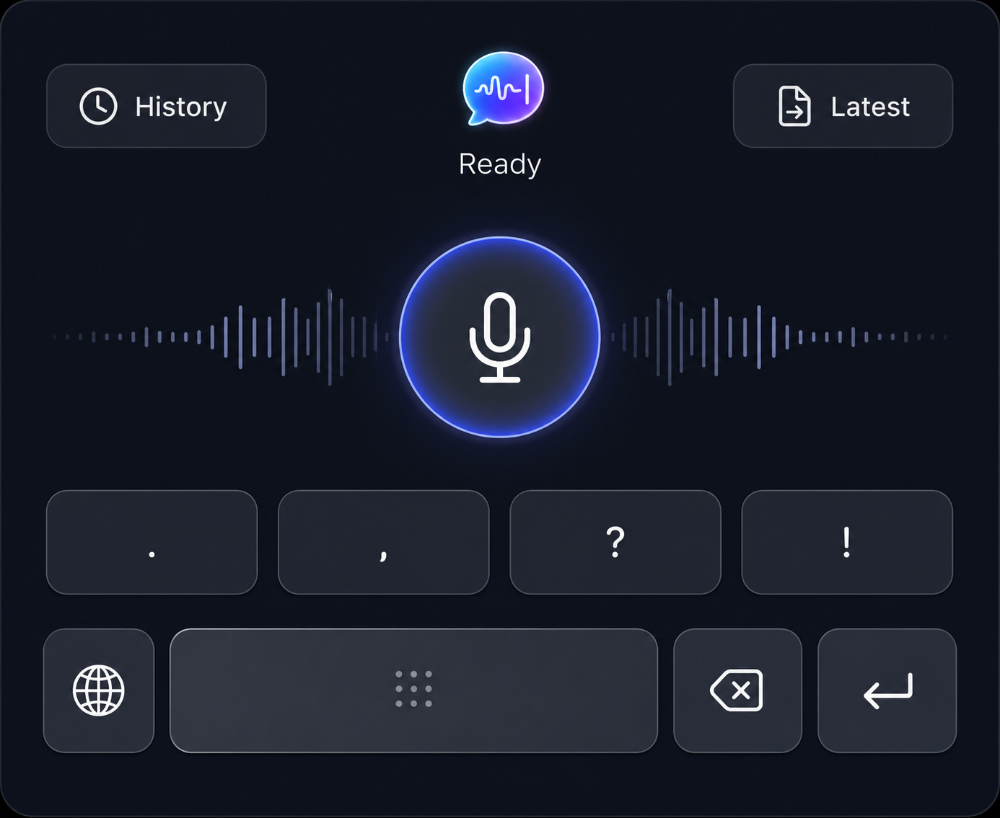
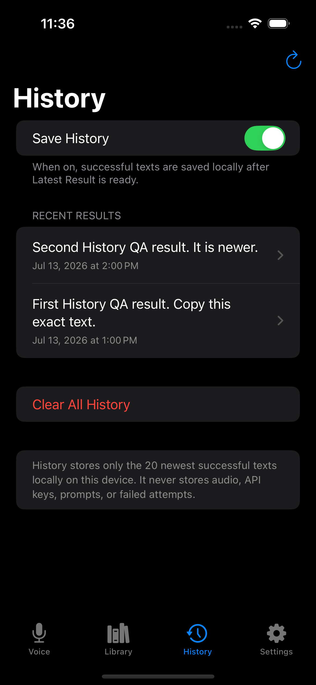
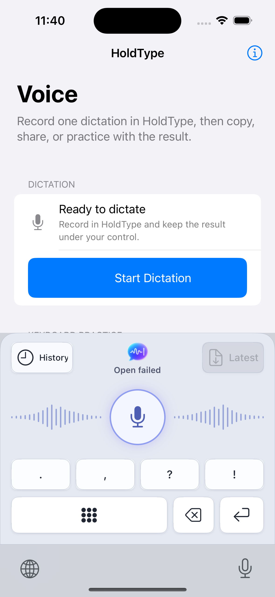

# iOS Brand Stage Keyboard QA

Date: 2026-07-13

Scope: production Brand Stage composition, concise status contract, Latest-only
shared cache, and containing-app History route.

## Result

The keyboard matches the approved Option 2 hierarchy in iPhone and iPad Light
and Dark appearances. It contains only controls and state: no transcript,
History row, card, preview, or QWERTY layout is rendered inside the extension.

The centered label is intentionally limited to:

- `Ready` when the local keyboard controls are usable;
- one short problem label, currently `Full Access` or `Open failed`.

It does not show action narration such as `Latest ready`, `Inserted`, or
`Opening History`. Latest availability is represented by the Latest button.

## Visual Evidence

Approved source:

| Device | Light | Dark |
| --- | --- | --- |
| iPhone 16, iOS 18.6 | [Screenshot](assets/ios-brand-stage-keyboard-2026-07-13/iphone-light.png) | [Screenshot](assets/ios-brand-stage-keyboard-2026-07-13/iphone-dark.png) |
| iPad Pro 11-inch, iOS 26.0 | [Screenshot](assets/ios-brand-stage-keyboard-2026-07-13/ipad-light.png) | [Screenshot](assets/ios-brand-stage-keyboard-2026-07-13/ipad-dark.png) |

The four captures verify:

- equal History and Latest geometry;
- a centered transparent HoldType mark with no square background;
- one-line compact status text;
- distinct keyboard and host-app surfaces;
- unchanged hierarchy and geometry between appearances;
- bounded iPad content width instead of stretched controls.

## History Route Evidence

The containing app registers the strict `holdtype://history` route. Opening it
with `simctl openurl` selected the real History destination:

This proves app-side route registration and navigation only. A real History tap
from the keyboard called public `NSExtensionContext.open`; iOS 18.6 Simulator
returned `false`, and the keyboard displayed the required compact failure:

No private responder-chain or `UIApplication` workaround is present. Direct
keyboard-to-app launch therefore remains a signed-device and review gate rather
than a release claim. [Apple App Review Guideline 4.4.1](https://developer.apple.com/app-store/review/guidelines/)
also says keyboard extensions must not launch apps other than Settings.

## Shared Cache Boundary

- The snapshot contains schema/revision metadata and at most one Latest item.
- An already-expired Latest result is omitted instead of copying its text into
  App Group storage.
- App startup atomically replaces legacy schema 1/2 payloads with an empty
  schema 3 snapshot even while production Latest publication is gated.
- History, recent-result arrays, settings, prompts, audio, provider payloads,
  and credentials never enter this snapshot.

## Automated Evidence

- Full `HoldType-iOS` iPhone Simulator test run: 1,006 passed, 0 failed,
  0 skipped.
- Focused `KeyboardBridgeIOSTests` and
  `IOSKeyboardSnapshotPublisherTests`: passed.
- `HoldType-iOS` generic Simulator Release build: passed.
- `HoldType` macOS build: passed.
- `git diff --check`: passed.

All automated launches used the sanitized UI-test environment. No live
Keychain prompt, microphone capture, or OpenAI request was used.

## Remaining Gate

A signed physical iPhone still must verify the Full Access off/on boundary,
host-app fallbacks, Latest insertion, and the public History-launch result. The
Simulator failure is honest evidence that the current review-safe public path
does not satisfy the requested direct History launch on its own.
