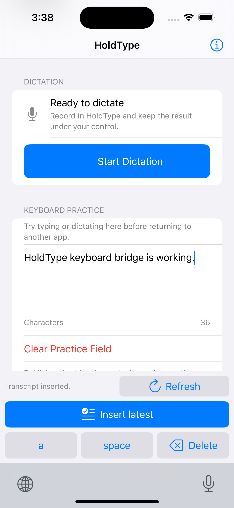

# iOS R0 Baseline And Keyboard Simulator QA

Date: 2026-07-13

Device: iPhone 16 simulator, iOS 18.6 (`71E5A24E-74E4-49EE-BDFB-026C4C15CCCC`)

Scope: V1.1 R0 reset plus bounded Phase-0 keyboard runtime evidence

## Baseline Reset

- Restored the two authorized uncommitted P5H-2 files to their committed
  contents.
- Reverted the dependent integration test first in `c50a62f`, then reverted
  the implementation in `2b2d4e1`.
- Removed the remaining workflow switch branch and test that depended on the
  reverted acceptance outcome. The branch came from a later commit and was not
  removed by either requested revert; retaining it made the post-revert source
  uncompilable.
- No P5H captured-foreground acceptance outcome remains selected by the
  containing-app Voice workflow.

## Automated Evidence

- `HoldType-iOS` simulator build with signing disabled: passed.
- `HoldType-iOS` simulator build with normal local simulator signing: passed.
- `IOSForegroundVoiceWorkflowTests`: 62 passed, 0 failed.
- `IOSForegroundVoiceProcessorTests`, `IOSForegroundVoicePersistenceTests`,
  and `IOSContainingAppRecoveryTests`: 85 test methods passed, 0 failed.
- `HoldType` macOS build: passed.
- `git diff --check`: passed.
- The built app contains `HoldTypeKeyboard.appex`; its processed extension
  plist declares `com.apple.keyboard-service`, `en-US`, and
  `RequestsOpenAccess = false`.
- The locally signed simulator build registered
  `group.app.holdtype.HoldType.shared`; `simctl get_app_container ... groups`
  returned its shared App Group container.

## Simulator Runtime Evidence

- Installed and launched the containing app with automation Keychain access
  disabled.
- Added `HoldType` through Settings > General > Keyboard > Keyboards > Add New
  Keyboard. The enabled keyboard list persisted
  `app.holdtype.HoldType.ios.keyboard`.
- Focused `ios.voice.practice-field` and showed the software keyboard.
- Globe switching cycled through the enabled input modes and reached the
  HoldType extension.
- In the extension, tapping `a` changed the field to `a`; tapping `space`
  changed it to `a `; tapping `Delete` returned it to `a`.
- The initial signing-disabled build correctly reported that shared state was
  unavailable. Rebuilding with normal local simulator signing registered the
  App Group; the containing-app probe then published its ten-minute sample and
  the extension reported `Accepted transcript is ready.`
- `Insert latest` inserted exactly
  `HoldType keyboard bridge is working.` into the practice field. The field
  reported 36 characters and the extension reported `Transcript inserted.`
- The extension Globe control returned to the system keyboard.

## Gate Boundary

This closes the old Phase-0 simulator evidence gap for installation,
enablement, Globe switching, basic document-proxy editing, App Group sample
handoff, explicit insertion, and extension rendering. It does not pass D0.

D0 still requires a signed physical iPhone for microphone handoff, Full Access
off/on App Group behavior, Notes insertion, secure and phone-pad fallback,
host opt-out, process eviction, snapshot expiry, and the manual return path.
