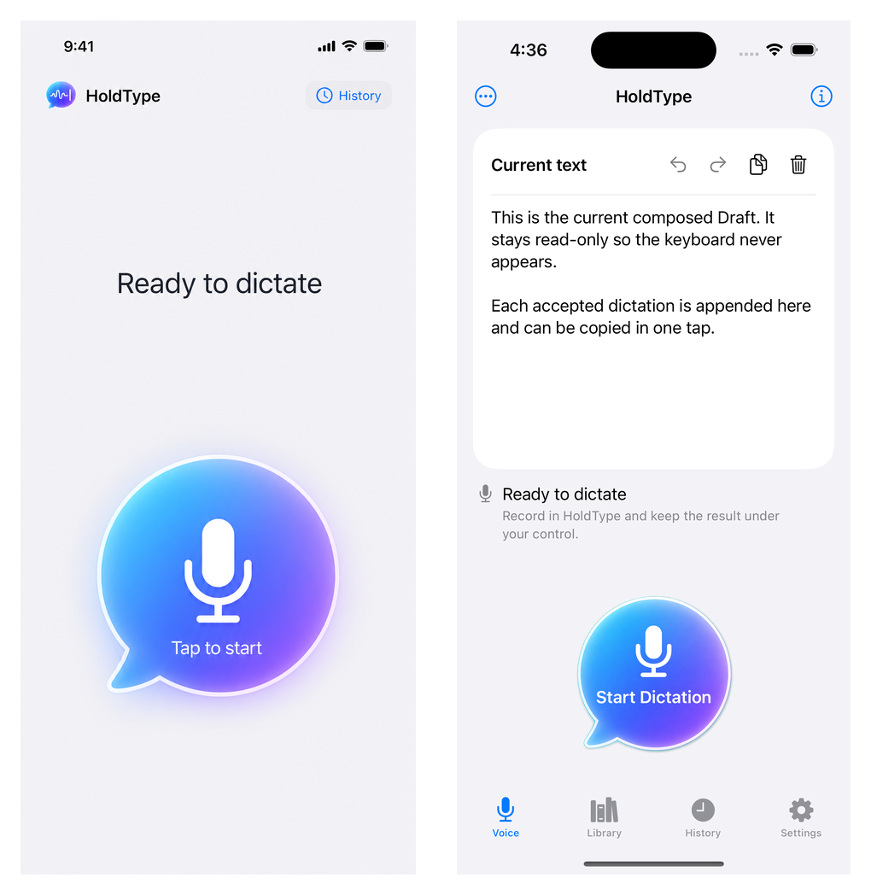
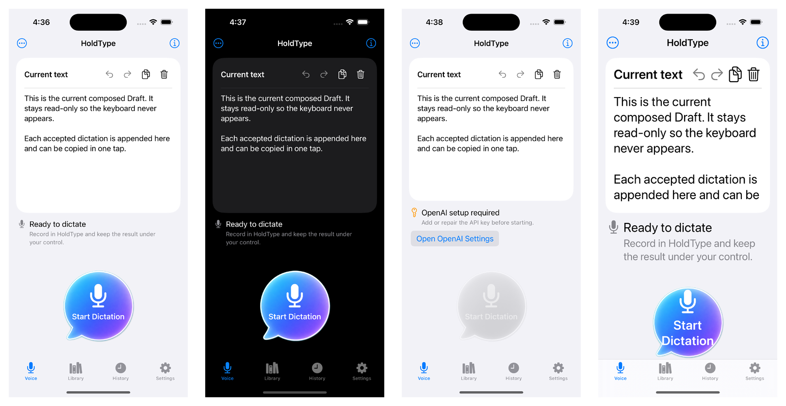

# iOS Voice Draft QA

Date: 2026-07-14

Scope: first-tab Voice screen, protected composed Draft, clipboard and clear
actions, session-only Undo/Redo, exact accepted-result append, disabled
recovery presentation, generated Retina primary-control asset, and cold-launch
routing.

## Result

Voice is now the cold-launch destination. It presents one read-only,
vertically scrollable Draft with Undo, Redo, Copy, and Clear actions. The
primary dictation control stays in the lower thumb region. History remains a
separate tab, while translation and Keyboard Session are kept under the compact
More menu.

Every accepted Voice result is offered to the Draft exactly once by result ID.
The current Draft survives relaunch, while the bounded twenty-snapshot
Undo/Redo stacks remain process-local. A Draft failure never rolls back Latest,
History, Pending, cache, or keyboard projection state.

## Visual Evidence

The selected ImageGen concept and final native screen are shown together:

The rendered state matrix covers standard Light, Dark, OpenAI setup blocked
with a grey primary action, and accessibility text sizing:

All captures use the side-effect-free DEBUG qualification route on iPhone 16,
iOS 18.6 Simulator, with `HOLDTYPE_AUTOMATION=1`. They access no live Keychain
item, microphone, API key, provider, or network service.

## Automated Evidence

- Draft persistence tests cover protected storage policy, canonical encoding,
  strict decoding, exact-once append, collision rejection, the 100-segment
  bound, and compare-and-swap replacement.
- Draft owner tests cover refresh, relaunch persistence, append, Clear,
  Undo/Redo, forward-branch removal, write failure preservation, and stale
  external mutation recovery.
- runtime publication coverage proves that only accepted output is offered to
  the Draft and keyboard projection.
- the existing containing-app destination contract keeps Voice first and uses
  Voice as the invalid-selection fallback.

- Full `HoldType-iOS` Simulator suite on iPhone 17 Pro, iOS 26.5: 1,081
  passed, 0 failed, 0 skipped.
- Full `HoldTypePersistence` package suite: 206 passed, 0 failed.
- Focused Draft owner, acceptance publication, shell, and qualification-route
  suite: passed.
- Generic iOS Simulator build and iPhone 16 qualification build: passed.
- macOS `HoldType` baseline build with automation Keychain access disabled:
  passed.
- `git diff --check`: passed before checkpoint.

## Device Boundary

Simulator evidence proves the containing-app UI and deterministic local state.
It does not prove physical microphone capture, device signing, the privacy
indicator, or keyboard insertion in a real host. This feature did not change
the recorder or signed-device boundary, so no physical iPhone was required for
this implementation checkpoint.
