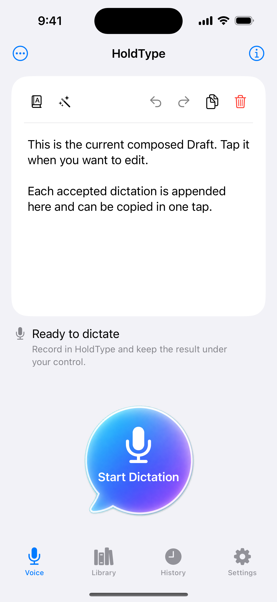
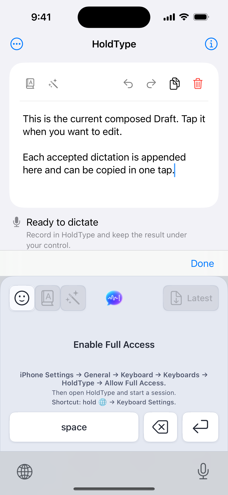
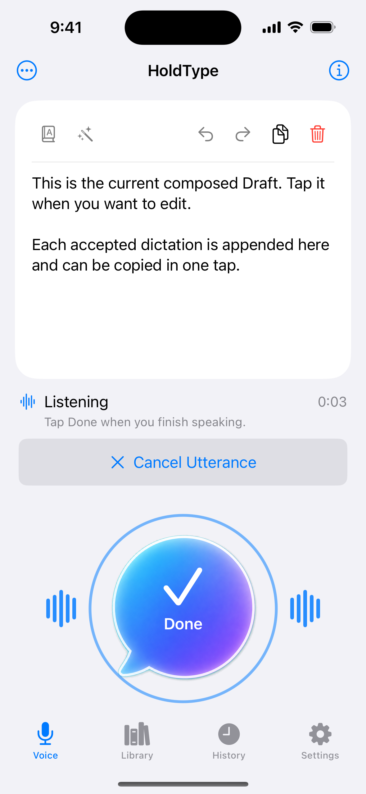
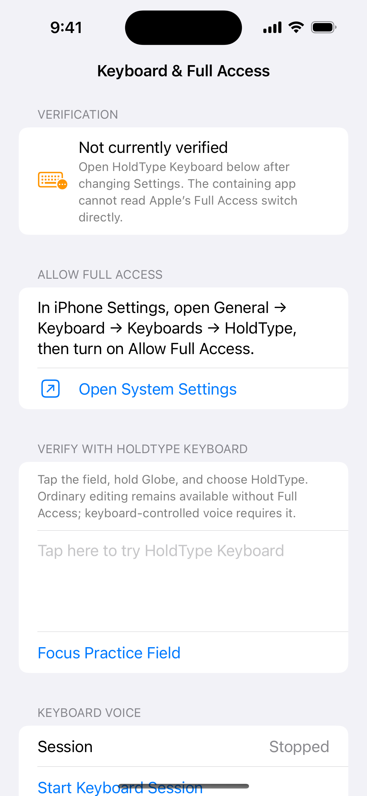

# iOS Voice Editor, Recovery, And Recording Waves QA

Date: 2026-07-14

Scope: tap-to-edit Voice Draft, persistence migration, edit conflict safety,
microphone-level recording waves, and the Keyboard & Full Access recovery
route.

## Result

The first Voice tab now opens with an unfocused Draft editor, so the software
keyboard does not cover the primary dictation control on launch. Focusing the
Draft intentionally presents the keyboard and a Done control. Exact manual
text, pasted text, and emoji persist in the editable v2 record; one edit session
creates one session-local Undo snapshot. A concurrent Draft change blocks later
autosaves from overwriting the external result and preserves the working text
for review or copying.

Listening presents mirrored level bars on both sides of the primary control.
The live path reads bounded `AVAudioRecorder` metering values, normalizes the
`-60...0 dB` range, and returns no level outside the active recording attempt.
The deterministic qualification route uses a fixed level only to render the
visual state without microphone or provider side effects.

Keyboard and Full Access recovery now opens a dedicated Settings route with the
exact iPhone Settings path, a public app-settings link, a real practice field,
the keyboard-session control, and a truthful unverified state. The containing
app does not claim to read Apple's Full Access switch directly.

## Visual Evidence

All Simulator captures use iPhone 16, iOS 18.6, a sanitized automation launch,
and DEBUG-only qualification routes. No live Keychain value, provider call, or
microphone capture was used.

## Automated Evidence

- Full `HoldType-iOS` Simulator suite: 1,089 passed, 0 failed, 0 skipped.
- `HoldTypePersistence` package suite: 209 passed, 0 failed.
- Focused Draft owner, recorder adapter, recorder bridge, and Voice controller
  suites: passed.
- Generic iOS Simulator build: passed.
- Signed iPhone build: passed for iPhone 14 Pro Max.
- App and extension installation plus sanitized qualification launch on the
  connected iPhone: passed.
- App and extension identifiers, signing team, and App Group match; the app has
  the microphone purpose string and the extension declares
  `RequestsOpenAccess = true`.

## Evidence Boundary

Simulator evidence proves the containing-app UI, focus contract, deterministic
level rendering, local persistence, and recovery navigation. The signed-device
pass proves build, signing, installation, and launch. It does not yet prove
real microphone amplitude, the system privacy indicator, or record/finish/
cancel lifecycle on the physical iPhone; those remain a separate interactive
device qualification gate.

Tooling: xcodebuild, simctl, devicectl
Runtime QA: Simulator passed; signed-device build/install/launch passed;
physical microphone lifecycle not run
