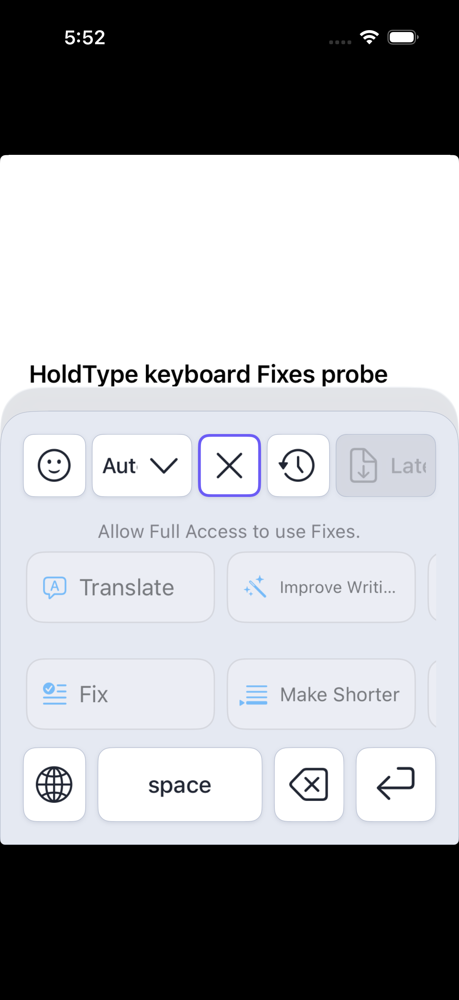

# Text Fixes Implementation QA

Date: 2026-07-23

Scope: HoldType Text Fixes from the shared catalog and provider through the
macOS palette/editor, iOS Voice and editor, and the keyboard extension.

Contract:

- `docs/specs/features/text-fixes.md`
- the active platform specs referenced by
  `docs/text-fixes-implementation-plan.md`
- global macOS invocation is `Option+J`

## Result

The implementation and Text Fix-specific automated qualification pass. The
full macOS suite also passes. Simulator runtime qualification covers iOS Voice,
the iOS editor, and the actual embedded HoldType keyboard extension.

This run does not claim complete release qualification. The following live
gates remain:

1. the representative macOS host matrix, including real `Option+J`, target
   capture, refusal, focus-loss, placement, and host Undo behavior;
2. end-to-end keyboard behavior in real host apps on a signed physical iPhone;
3. the final live normal/debug log audit and the remaining VoiceOver, Dynamic
   Type, and RTL checks.

The paired physical iPhone was locked during device setup, so Xcode could not
mount its Developer Disk Image. A generic `iphoneos` Debug build and strict
signature verification passed, but that is signing evidence only, not physical
runtime evidence.

## macOS

Verified:

- the full macOS unit suite passed: **568 passed, 0 failed, 0 skipped**;
- targeted coverage includes `Option+J`, versioned OpenAI consent, pre-focus
  target capture, exact-range replacement, stale-target rejection, palette
  interaction, native status-item activation, the application Quit menu,
  catalog editing, and typed/custom execution;
- the menu action captures availability before its popover can steal focus and
  is disabled when no compatible external target can be captured;
- opening a HoldType-owned editor preserves the last valid external menu target
  while stale, secure, or otherwise incompatible external focus clears it;
- the Fixes editor is a separate normal window, and SwiftUI navigation changes
  cannot replace its stable `HoldType: Edit Fixes` window title;
- the app and test bundle use the same configured Apple Development identity.

Full-suite result bundle:

`~/Library/Developer/Xcode/DerivedData/HoldType-aiagnlkblhltvacjmbtlpyjistgi/Logs/Test/Test-HoldType-2026.07.23_18-58-04-+0200.xcresult`

Not claimed by this run:

- live replacement in TextEdit, Notes, Safari, Chrome, and Xcode;
- secure/custom-control refusal and one-step host Undo across that matrix;
- real pointer, keyboard, and VoiceOver activation of the menu-bar status item;
- multi-monitor and screen-edge placement in live external apps.

The sanitized debug app ran as a menu-bar-only UI element without opening an
accidental blank Settings window. The available Computer Use surface could not
attach to the status item/SystemUIServer, so that launch is not reported as
visual menu acceptance. The installed HoldType and FixKey processes were left
untouched, and this run makes no shortcut-owner claim.

## iOS Voice And Editor

The iPhone 17 Pro Simulator on iOS 26.5 was run with
`HOLDTYPE_AUTOMATION=1` and sanitized Keychain behavior.

Runtime smoke verified:

- the Fixes surface exposes the eight default actions with Translate and Fix
  first;
- a controlled Improve Writing request replaces the Draft;
- Undo restores the exact source;
- Library exposes the separate Fixes editor and its search/add/edit flows.

The full `HoldType-iOS` suite recorded **735 total: 725 passed, 10 failed,
0 skipped**. All Text Fix-specific Voice Draft tests passed, including:

- exact selected-range replacement and complete-Draft fallback;
- UTF-16/composed-Unicode selection handling;
- commit-before-reservation and stale-selection rejection;
- repository-revision rejection;
- atomic replacement with one Undo snapshot;
- rejection of late stale results.

The separate consent-v3 package test also passed:
`IOSV1ProviderConsentTests/versionThreeAcceptanceRequiresReviewForTextFixes()`.

Full-suite result bundle:

`~/Library/Developer/XcodeBuildMCP/workspaces/holdtype-swift-bde3b777455d/result-bundles/test_sim_2026-07-23T16-19-17-704Z_pid46554_7b9b23a7.xcresult`

The ten broader failures were all reproduced against pre-Text-Fixes commit
`5de22c44cff981d8797077f55e07c0f7eb5447e3`, the parent of the first feature
commit:

- three aggregate-loss tests hang until their bounded timeout;
- six existing cancellation/recorder/workflow expectations fail with the same
  assertions;
- one emoji editor presentation test expects `Russian` while the current
  localized output is `Русский`.

The affected test and implementation blobs are unchanged between that base and
the current feature work. They remain repository baseline debt; this QA record
does not count them as Text Fix regressions.

## Embedded Keyboard Extension

A bounded standalone UIKit host and XCUITest were generated for the run and
removed afterward. The test selected HoldType through the system input
switcher, so the evidence covers the actual embedded keyboard extension rather
than a copied SwiftUI preview.

Observed with Full Access off:

- the center Fixes control exists and has a touch target of at least 44 points;
- Fixes opens the scrollable tile workspace;
- the workspace shows “Allow Full Access to use Fixes.”;
- Translate, Improve Writing, Fix, and Make Shorter tiles are visible;
- Quick Insert and Fixes are mutually exclusive in both directions;
- no provider or Keychain request is attempted.

The bounded XCUITest passed: **1 passed, 0 failed**.

Result bundle:

`~/Library/Developer/XcodeBuildMCP/workspaces/holdtype-swift-bde3b777455d/result-bundles/test_sim_2026-07-23T15-52-05-119Z_pid72635_b98a0f0a.xcresult`

Physical-device signing audit:

- paired device: iPhone 14 Pro Max, iOS 26.5.2;
- the app and keyboard profiles include that device, have the expected App
  Group, and were valid through 2027-07-14;
- generic `iphoneos` Debug build and
  `codesign --verify --deep --strict` passed;
- the device-specific build stopped before compilation with
  `kAMDMobileImageMounterDeviceLocked` and `passcodeRequired=true`.

Accordingly, selected-text replacement, Full Access on/off, focus survival,
extension recreation, and real host proxy behavior remain unqualified on a
physical iPhone.

## Shared Packages

Full package regression results:

| Package | Result | Interpretation |
| --- | --- | --- |
| HoldTypeDomain | **182/182 passed** | Full suite green |
| HoldTypeOpenAI | **129/129 passed** | Full suite green |
| HoldTypeIOSCore | **64/64 passed** | Full suite green |
| HoldTypePersistence | **253 passed, 17 failed, 270 total** | The same 17 `.invalidTransition` failures reproduce at the pre-feature base; focused Text Fix catalog persistence tests pass |

The first Text Fix catalog release starts at schema version 1, so there is no
older production Text Fix schema to migrate. Coverage verifies first-run
defaults, strict decoding, corrupt-data handling, unsupported-version
preservation, and recovery without silently deleting recoverable custom
actions.

## Privacy And Safety

- live OpenAI credentials were not used;
- runtime UI used controlled provider behavior;
- Keychain access stayed sanitized during automation;
- Full Access remained off in the Simulator keyboard check;
- source text, prompts, provider output, and credentials were not added to
  normal product logs;
- automated coverage exercises versioned consent, TTL, cancellation, stale
  results, strict decoding, metadata-only projection, and exactly-once result
  claims.

## Remaining Release Qualification

Before claiming the complete acceptance matrix:

1. run `Option+J`, selection, whole-field, stale-target, unsupported/secure,
   focus-loss, Undo, and placement checks in the documented macOS hosts;
2. activate the menu-bar status item with pointer, keyboard, and VoiceOver;
3. on the paired unlocked signed iPhone, enable HoldType deliberately, exercise
   Full Access off/on, transform selected text in single- and multiline hosts,
   and confirm partial/nil/no-selection contexts fail closed;
4. exercise timeout, cancellation, extension eviction/recreation, TTL expiry,
   exactly-once claim, and app cold-state behavior on that device;
5. finish VoiceOver, Dynamic Type, RTL, and live normal/debug log checks without
   exposing source text, prompts, output, or credentials.
